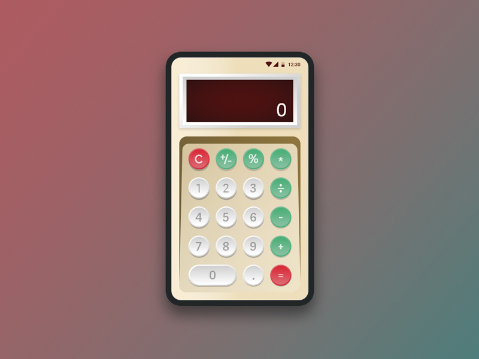
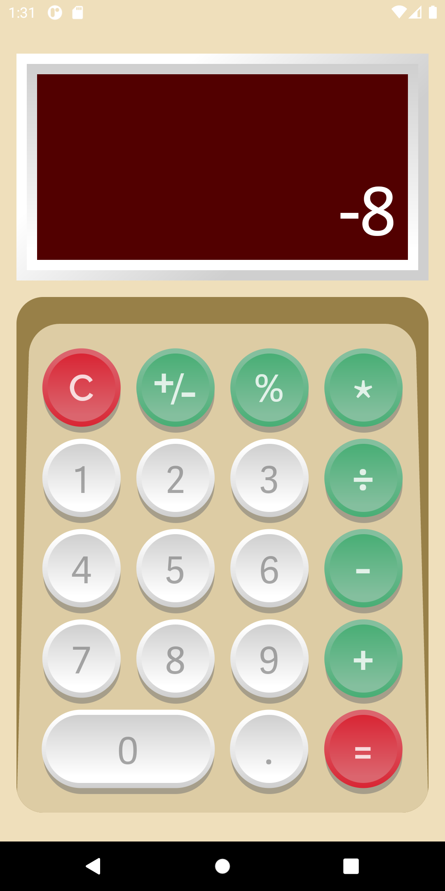
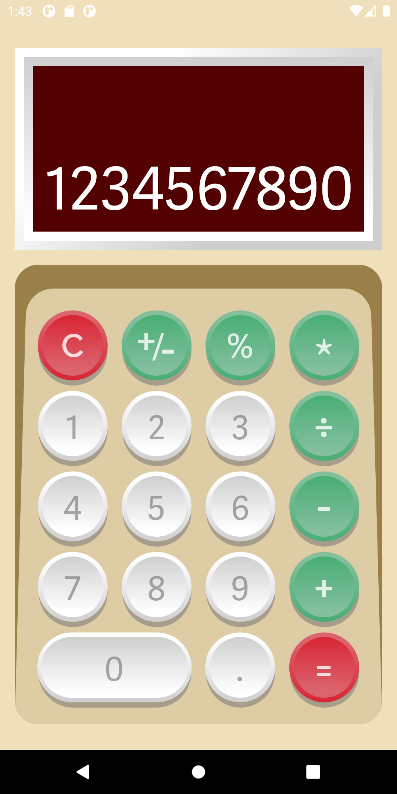

# Retro Calculator

### Retro Calculator [Design UI](https://www.uplabs.com/posts/retro-calculator-app) 

<h1 align="center">
  
</h1>

### Retro Calculator [Implementation](/retro_calculator)

    
    
    
    
    

